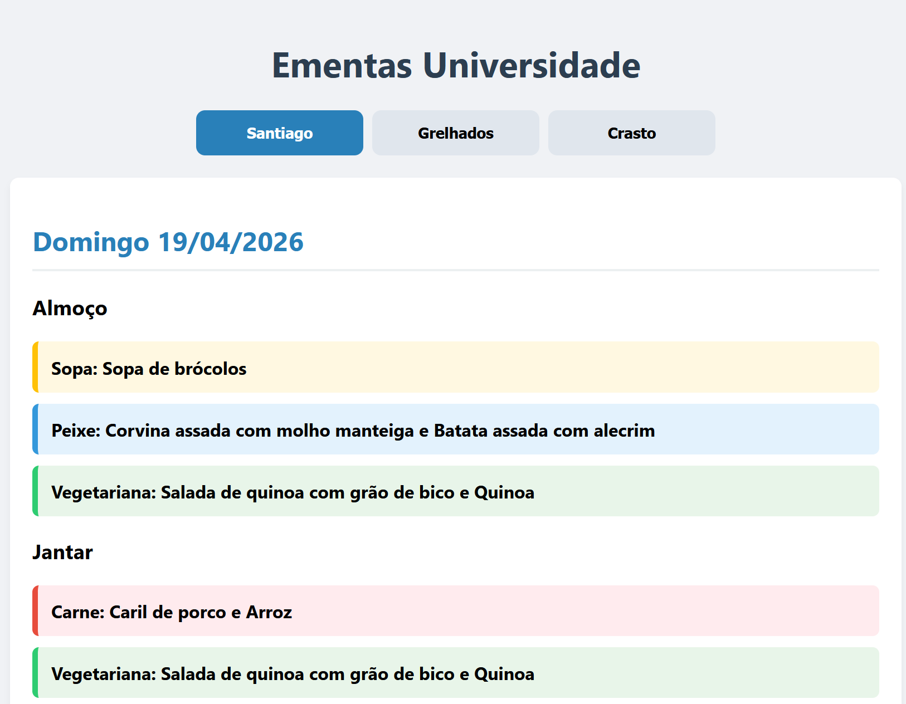

# 🍲 Universidade de Aveiro - Automated Menus

**Live Demo:** [Click here to view the live website](https://guilhermealma.github.io/ementas-ua)

### About the Project
A fully automated Python script that scrapes the daily menus from the Universidade de Aveiro canteens (Santiago, Grelhados, and Crasto). It deploys a mobile-friendly webpage accessible from any network, removing the need to be connected to Eduroam or a VPN.

### ⚙️ Core Features
* **Automated Scraping:** Uses `BeautifulSoup4` to parse HTML tables from the university's CMS.
* **Smart Data Parsing:** Cleans up text, removes unnecessary prefixes, and automatically categorizes dishes (Meat, Fish, Diet, Vegetarian) by color.
* **Zero-Cost CI/CD Pipeline:** Uses a local Windows Task Scheduler trigger to execute the script and push updates to GitHub Pages automatically every Monday.
* **Responsive UI:** A lightweight, vanilla HTML/CSS/JS frontend featuring a tabbed interface for easy mobile viewing.

### 🛠️ Tech Stack
* **Language:** Python
* **Libraries:** `requests`, `BeautifulSoup4`, `urllib3`, `re`
* **Deployment:** Git, GitHub Pages
* **Frontend:** HTML, CSS, JavaScript

### 🚀 How It Works
1. The Python script fetches the raw HTML from the three canteen URLs.
2. It processes the table rows, groups main dishes with their side dishes, and assigns CSS classes based on keywords.
3. It generates a single `index.html` file with an embedded JavaScript tab system.
4. Using the `subprocess` module, the script automatically commits and pushes the new HTML file to GitHub.
